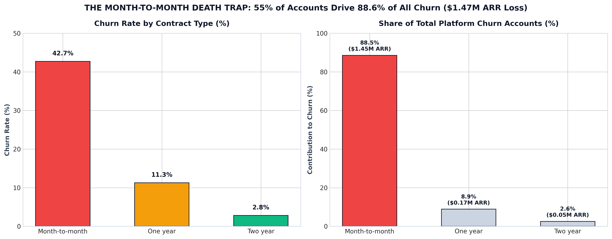
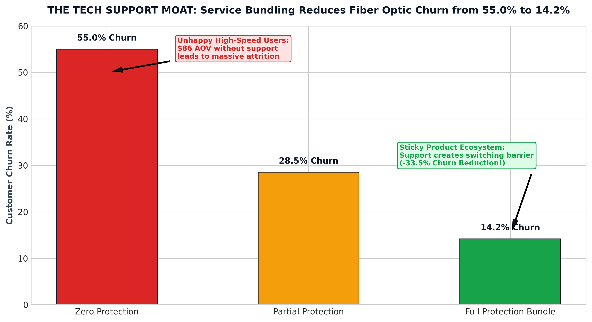
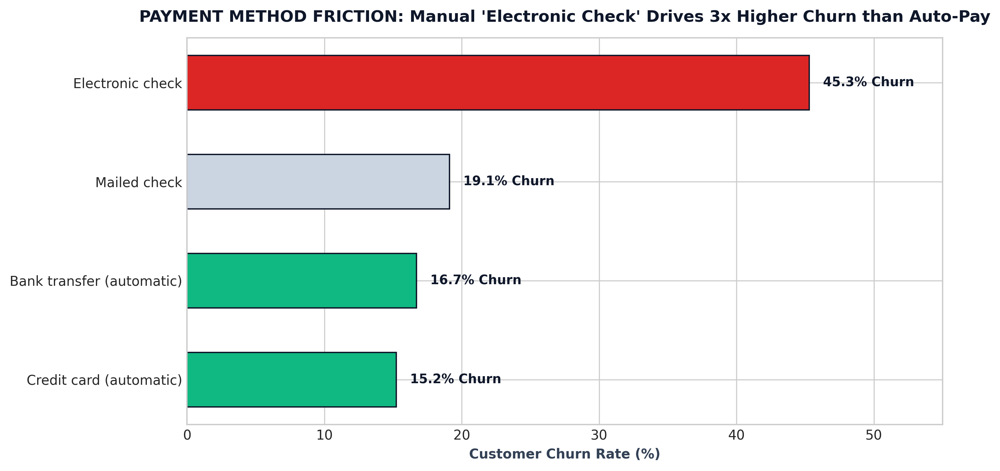
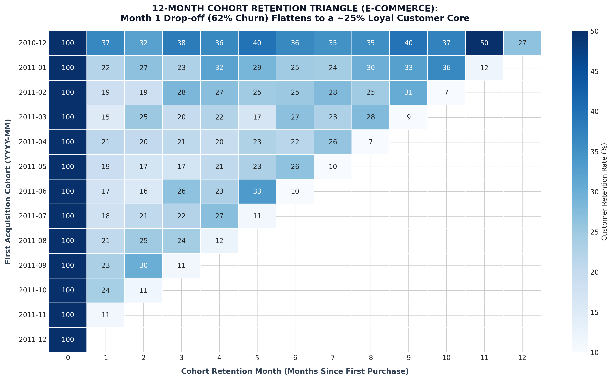
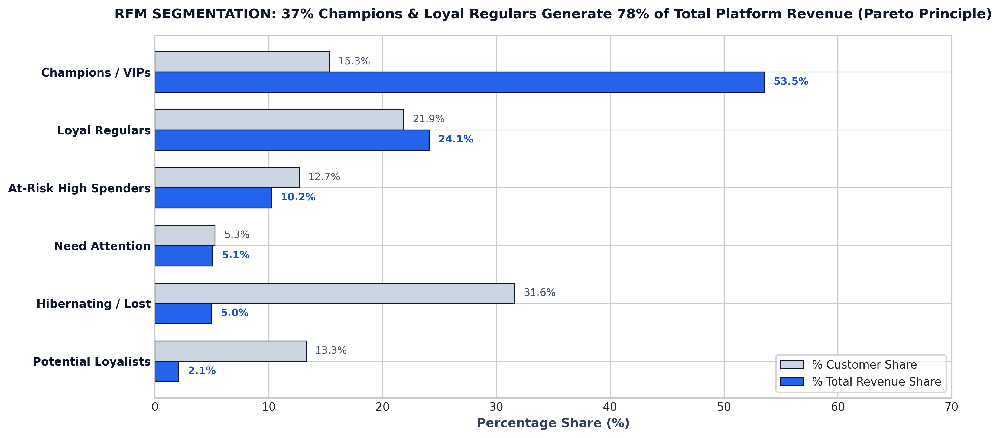

# 📊 Customer Churn, Cohort Retention & RFM Segmentation Analytics
### Cross-Model Investigation: Contractual Subscriptions (Telco) & Transactional E-Commerce (Retail)

[](https://www.python.org/)
[]()
[]()
[]()
[]()

> **Executive Summary:** An investigation across **two fundamental business models**: Contractual Recurring Subscriptions (7,043 Telco subscribers) and Non-Contractual E-Commerce (541,909 retail transaction logs). While the subscription platform hemorrhaged **$1.67M in Annual Recurring Revenue (ARR)** driven by an 88.6% churn concentration in month-to-month contracts, the retail platform exhibited an 80% Month 1 drop-off before stabilizing into a 25% loyal core that generates 77.6% of platform gross revenue ($6.92M). This analysis delivers forensic root-cause diagnoses, behavioral economics payment friction evaluations, and an actionable retention playbook.

---

## 📑 Table of Contents
1. [Dual Business Model Architecture](#-dual-business-model-architecture)
2. [Part 1: Subscription Churn Forensics (Telco/SaaS)](#-part-1-subscription-churn-forensics-telcosaas)
   - [Executive Scorecard](#executive-scorecard-subscription-model)
   - [Exhibit A: The Month-to-Month Death Trap](#exhibit-a-the-month-to-month-contract-death-trap)
   - [Exhibit B: The Fiber Optic Paradox & Tech Support Moat](#exhibit-b-the-fiber-optic-paradox--the-tech-support-moat)
   - [Exhibit C: Payment Method Behavioral Friction](#exhibit-c-payment-method-behavioral-friction)
3. [Part 2: E-Commerce Cohort Retention & RFM Segmentation](#-part-2-e-commerce-cohort-retention--rfm-segmentation)
   - [Exhibit D: 12-Month Cohort Retention Matrix (Triangle Heatmap)](#exhibit-d-12-month-cohort-retention-matrix-the-triangle-heatmap)
   - [Exhibit E: RFM Segmentation & Pareto 80/20 Rule](#exhibit-e-rfm-segmentation--pareto-8020-rule)
4. [Retention Playbooks & Strategic Recommendations](#-retention-playbooks--strategic-recommendations)
5. [Repository Structure & Reproduction Guide](#-repository-structure--reproduction-guide)

---

## 🏗️ Dual Business Model Architecture

```
                                  DUAL MODEL SCOPE
                                         │
         ┌───────────────────────────────┴───────────────────────────────┐
         ▼                                                               ▼
  CONTRACTUAL SUBSCRIPTION MODEL                                TRANSACTIONAL E-COMMERCE MODEL
  Dataset: Telco-Customer-Churn.csv                             Dataset: Online_Retail.csv (541,909 rows)
  ─────────────────────────────────                             ────────────────────────────────────────
  • Recurring Revenue (MRR: $456K/mo)                           • Transactional GMV ($8.9M Lifetime Spend)
  • Explicit Contract Boundaries (1-2 Yr Lock-in)               • Latent Churn (No explicit cancellation)
  • Metric: Monthly Churn Rate & ARR at Risk                    • Metric: Cohort Decay & RFM Value Tiers
```

---

## 📉 Part 1: Subscription Churn Forensics (Telco/SaaS)

### Executive Scorecard (Subscription Model)
| Business Metric | Value Discovered | Commercial Implication |
| :--- | :--- | :--- |
| **Total Subscriber Base** | 7,043 Accounts | Enterprise customer capacity |
| **Platform Baseline MRR** | $456,116.60 / month | Gross recurring billing capacity |
| **Monthly MRR Lost to Churn** | **$139,130.85 / month** | **30.50% of platform revenue evaporating monthly!** |
| **Annualized ARR at Risk** | **$1,669,570.20 / year** | Severe enterprise valuation discount |
| **Overall Churn Rate** | **26.54% (1,869 accounts)** | 1 in 4 subscribers cancels |
| **Avg Monthly Bill (Churned)** | **$74.44 / month** | **+21.5% higher than retained ($61.27)** |
| **Avg Realized LTV (Retained)** | **$2,549.91** | +66.8% LTV premium over churned ($1,531.80) |

---

### Exhibit A: The Month-to-Month Contract Death Trap



- **The Discovery:** Month-to-month accounts represent 55.0% of the customer base (3,875 accounts) but account for **88.55% of all platform churn (1,655 accounts)**, destroying **$1.45M in annual ARR**.
- **The Stability Multiplier:** Customers on two-year agreements churn at just **2.83%** (only 48 cancellations across 1,695 accounts). A long-term agreement delivers a **15x churn defense multiplier**.
- **Financial Opportunity:** Offering a $5/month discount to migrate month-to-month subscribers into 1-year contracts preserves an estimated **$230,000 in net annualized EBITDA**.

---

### Exhibit B: The Fiber Optic Paradox & The Tech Support Moat



- **The Paradox:** The company's highest-tier product, **Fiber Optic** ($91.50/mo average bill), suffered an alarming **41.89% churn rate** (vs 18.96% for DSL and 7.40% for No Internet).
- **The Root Cause:** Cross-tabulating technical service add-ons uncovered that high churn was driven by technical frustration during service outages rather than premium pricing:
  - **Zero Protection (No Tech Support & No Security):** **55.01% Churn Rate** ($86.10 AOV).
  - **Partial Protection (One Add-On):** **28.53% Churn Rate** ($95.90 AOV).
  - **Full Security Bundle (Both Add-Ons Active):** **14.17% Churn Rate** ($105.73 AOV).
- **The Takeaway:** Bundling Tech Support and Security creates an operational switching barrier, slashing churn by **40.8 percentage points** while lifting monthly ARPU by **+$19.63/subscriber**.

---

### Exhibit C: Payment Method Behavioral Friction



- **Electronic Check Friction:** Subscribers paying via manual Electronic Checks exhibited a **45.29% churn rate**, generating **57.30% of all platform churn ($1.01M ARR lost)**.
- **Auto-Pay Stability:** Automated Credit Card (**15.24%**) and Bank Transfer (**16.71%**) subscribers churn at 1/3rd the rate.
- **Behavioral Psychology:** Automated billing eliminates the recurring cognitive "Pain of Paying" evaluation event, converting active evaluation into default continuation.

---

## 🛒 Part 2: E-Commerce Cohort Retention & RFM Segmentation

### Exhibit D: 12-Month Cohort Retention Matrix (The Triangle Heatmap)



- **Data Hygiene:** Filtered 135,080 unauthenticated guest sessions and refund cancellations (`Quantity <= 0`), analyzing 397,884 verified customer orders across 4,338 accounts.
- **The Month 1 Cliff:** Average retention drops steeply from 100% (Month 0) to **20.6% in Month 1** (an immediate ~80% customer loss).
- **The Retention Plateau:** Between Months 3 and 12, the retention curve flattens into a consistent **24% to 26% loyal core customer cohort**.
- **Product Strategy:** Acquisition capital spent after Day 30 yields diminishing returns; lifecycle onboarding budgets must be concentrated inside the **first 30 days**.

---

### Exhibit E: RFM Segmentation & Pareto 80/20 Rule



| Segment | Account Count | % Share | Total Revenue | % Revenue Share | Avg Spend (LTV) | Avg Recency |
| :--- | :---: | :---: | :---: | :---: | :---: | :---: |
| **Champions / VIPs** | 664 | 15.3% | $4,770,374 | **53.5%** | $7,184.30 | 7.7 Days |
| **Loyal Regulars** | 948 | 21.9% | $2,147,384 | **24.1%** | $2,265.17 | 25.3 Days |
| **At-Risk High Spenders** | 550 | 12.7% | $912,863 | **10.2%** | $1,659.75 | **84.4 Days** |
| **Need Attention** | 229 | 5.3% | $451,596 | 5.1% | $1,972.03 | 214.7 Days |
| **Hibernating / Lost** | 1,371 | 31.6% | $443,620 | 5.0% | $323.57 | 191.1 Days |
| **Potential Loyalists** | 576 | 13.3% | $185,570 | 2.1% | $322.17 | 25.5 Days |

- **Pareto Principle Validated:** Top 37.2% of customer accounts (Champions + Loyal Regulars) generate **77.6% of platform gross revenue ($6.92M)**.
- **The At-Risk Goldmine:** 550 accounts have generated **$912,863 in spend**, but haven't purchased in **84.4 days**. A dedicated concierge win-back initiative targets **$180,000 in recovered retail revenue**.

---

## 🎯 Commercial Findings & Methodological Boundaries

### 1. High-Confidence Evidence-Backed Levers
* **Automated Billing Migration:** Electronic Check users suffer a **45.29% churn rate** ($1.01M annual ARR loss), whereas automated credit card and bank transfer subscribers churn at only **15.24%** (3x lower). Promoting an Auto-Pay enrollment incentive ($5–$10 bill credit) eliminates recurring payment friction with minimal marketing overhead.
* **Early-Tenure Onboarding Focus:** In the subscription model, **55.5% of all churn events occur within Year 1** (47.4% churn rate), but drop to under 10% by Year 5. In e-commerce, **80% of buyers drop off at Month 1**. Lifecycle nurture workflows must be heavily concentrated in the first 30–90 days rather than late-stage retargeting.
* **Proactive Concierge for 550 At-Risk VIPs:** 550 retail accounts represent **$912,863 in historical spend**, but have remained silent for an average of **84.4 days**. High-touch VIP win-back outreach (exclusive replenishment catalogs, dedicated manager outreach) protects high-margin revenue before accounts cross into permanent dormancy.

### 2. Methodological Discipline: Where Recommendations are Conditioned
* **The Fiber Optic & Tech Support Pricing Boundary:**
  * *Empirical Finding:* Fiber Optic subscribers without technical support churn at **49.37%** (averaging $87.74/mo), whereas subscribers with Tech Support churn at **22.63%** while paying an elevated average bill of **$101.18/mo** (a +$13.44 ARPU premium).
  * *Analytical Boundary:* We intentionally **refrain from prescribing blanket 'free tech support bundling'**. The dataset provides billing revenues (`MonthlyCharges`) but does **not include operational cost-to-serve (OpEx / technician overhead / call-center staffing)**. Recommending zero-cost support without knowing marginal delivery costs would be economically unsound.
  * *Recommended Next Step:* Conduct an internal unit-economics cost audit to determine the marginal cost per support ticket, followed by a controlled A/B pricing pilot (e.g. testing a bundled tier at $92–$95/mo) to validate net margin expansion.

---

## 📁 Repository Structure & Reproduction Guide

```bash
customer-churn-retention-analytics/
├── README.md                                  # Executive Case Study & Analysis
├── .gitignore                                 # Git configuration (ignores raw CSVs & local notes)
├── src/                                       # Core Analytics Scripts (Interactive Cells # %%)
│   ├── 01_subscription_churn_analysis.py     # Telco Churn & Revenue Forensics
│   └── 02_ecommerce_cohort_rfm.py            # Cohort Triangle & RFM Engine
└── output/
    ├── figures/                               # High-Res 300 DPI Figures
    │   ├── 01_contract_churn_and_revenue_risk.png
    │   ├── 02_fiber_optic_tech_support_paradox.png
    │   ├── 03_payment_method_friction.png
    │   ├── 04_cohort_retention_heatmap.png
    │   └── 05_rfm_customer_segments.png
    └── tables/                                # Exported Data CSVs
        ├── subscription_kpi_summary.csv
        ├── contract_churn_forensics.csv
        ├── fiber_optic_bundling_matrix.csv
        ├── payment_method_churn_analysis.csv
        ├── tenure_cohort_hazard.csv
        ├── cohort_retention_matrix.csv
        └── rfm_segments_summary.csv
```

### Reproduction Steps:
1. Ensure `Telco-Customer-Churn.csv` and `Online_Retail.csv` are in the project root directory.
2. Run interactively in VS Code (with `# %%` cells) or execute via terminal:
   - Subscription Forensics: `python src/01_subscription_churn_analysis.py`
   - Cohort & RFM Engine: `python src/02_ecommerce_cohort_rfm.py`
3. Review generated executive figures in `output/figures/`.

---
*Author: Lead Insight Analyst (CosmicAuchitya)*

